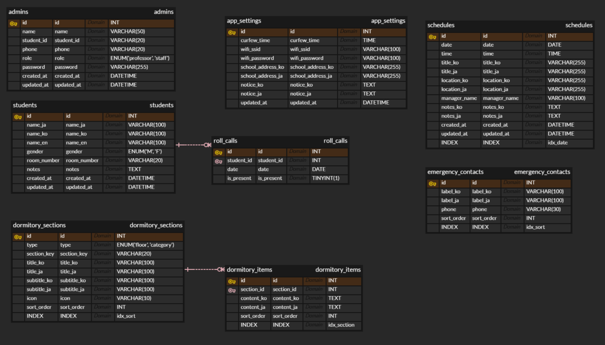

# YJUniWay

영진전문대학교(YJU)로 단기 유학을 오는 일본 대학생을 위한 관리 시스템.
일정, 생활관 규칙 안내, 학생 명단 등을 관리하며 한국어/일본어 두 언어를 지원한다.

---

## 기술 스택

| 영역 | 기술 |
|---|---|
| Frontend | React 19, Redux Toolkit, React Router v7, TypeScript, Vite |
| Backend | NestJS 11, TypeORM, TypeScript |
| Database | MySQL |
| 인증 | JWT (Passport) |
| 다국어 | i18next, react-i18next |
| API 문서 | Swagger (`/api/docs`) |

---

## 프로젝트 구조

```
YJUniWay/
├── frontend/                  # React 앱 (Vite)
│   └── src/
│       ├── pages/             # 페이지 컴포넌트
│       │   ├── Main/          # 메인 (오늘 일정, 통금, 공지 등)
│       │   ├── Dormitory/     # 기숙사 (시설 안내, 규칙, 세탁기 사용법)
│       │   ├── Schedule/      # 전체 일정
│       │   ├── StudentList/   # 명단 (관리자 전용)
│       │   └── Admin/         # 관리자
│       ├── components/
│       │   └── common/        # 공통 컴포넌트
│       ├── store/             # Redux store
│       │   └── slices/        # Redux Toolkit slices
│       ├── hooks/             # useAppDispatch, useAppSelector
│       ├── i18n/              # 한국어(ko.json) / 일본어(ja.json)
│       ├── types/             # TypeScript 타입 정의
│       └── utils/
│           └── api.ts         # axios 인스턴스
│
├── backend/                   # NestJS 앱
│   └── src/
│       ├── modules/
│       │   ├── schedule/      # 일정 CRUD
│       │   ├── dormitory/     # 기숙사 콘텐츠
│       │   ├── student/       # 학생 명단
│       │   ├── admin/         # 관리자 인증 및 관리
│       │   └── settings/      # 통금 시간 등 설정값
│       ├── common/
│       │   ├── guards/        # JWT 인증 가드
│       │   ├── interceptors/  # 응답 포맷 인터셉터
│       │   └── decorators/    # @Roles 등 커스텀 데코레이터
│       └── config/
│           └── database.config.ts
│
├── .env.example               # 환경변수 템플릿
├── .gitignore
└── package.json               # 루트 (npm workspaces)
```

---

## 페이지 구성

| 페이지 | 접근 | 주요 기능 |
|---|---|---|
| 메인 | 전체 (링크) | 오늘/내일 일정, 통금 시간, WiFi 복사, 긴급 연락처, 공지 |
| 기숙사 | 전체 (링크) | 시설 안내, 규칙, 세탁기 사용법, 통금 |
| 일정 | 전체 (링크) | 전체 일정 목록 |
| 명단 | 관리자 | 학생 정보, 점호 체크리스트, PDF/이미지 파싱 |
| 관리자 | 관리자 (로그인) | 일정 CRUD, 공지 편집, 학생 명단 관리, 통금 설정 |

> 학생 페이지는 로그인 없이 링크를 아는 사람만 접근 가능.
> 관리자 페이지는 별도 로그인 필요.

---

## 주요 기능

- **다국어**: 관리자가 한 언어로 입력 → AI 자동 번역 → 한/일 두 버전 저장
- **PDF/이미지 파싱**: 업로드 → AI 파싱 → 관리자 확인/수정 → 확정
- **모바일 퍼스트**: 주 사용 환경이 모바일이므로 모바일 UI/UX 기준으로 설계
- **관리자 권한**: 교수/학생(조교) 권한 분리 (현재는 동일 기능, 향후 확장 예정)

---

## 시작하기

### 1. 환경변수 설정

```bash
cp .env.example backend/.env
# backend/.env 에서 DB 접속 정보 및 JWT_SECRET 수정
```

### 2. 의존성 설치

```bash
npm install
```

### 3. 개발 서버 실행

```bash
# Frontend (http://localhost:5173)
npm run dev:frontend

# Backend (http://localhost:3000)
npm run dev:backend

# Swagger API 문서
# http://localhost:3000/api/docs
```

### 4. 빌드

```bash
npm run build:frontend
npm run build:backend
```

---

## 환경변수 (`backend/.env`)

| 변수 | 설명 | 예시 |
|---|---|---|
| `NODE_ENV` | 실행 환경 | `development` |
| `PORT` | 백엔드 포트 | `3000` |
| `FRONTEND_URL` | CORS 허용 URL | `http://localhost:5173` |
| `DB_HOST` | DB 호스트 | `localhost` |
| `DB_PORT` | DB 포트 | `3306` |
| `DB_USERNAME` | DB 유저명 | `root` |
| `DB_PASSWORD` | DB 비밀번호 | - |
| `DB_NAME` | DB 이름 | `yjuniway` |
| `JWT_SECRET` | JWT 서명 키 | - |
| `JWT_EXPIRES_IN` | JWT 만료 기간 | `7d` |
| `VITE_API_URL` | 프론트에서 사용할 API URL | `http://localhost:3000/api` |

## API 엔드포인트

> 🔒 자물쇠 표시된 엔드포인트는 JWT Bearer 토큰 필요 (관리자 전용)
> Swagger 문서: `http://localhost:3000/api/docs`

### 관리자 `/api/admin`

| 메서드 | 경로 | 설명 |
|---|---|---|
| POST | `/api/admin/login` | 관리자 로그인 |
| GET | `/api/admin` | 🔒 관리자 목록 조회 |
| POST | `/api/admin` | 🔒 관리자 등록 |
| PUT | `/api/admin/:id` | 🔒 관리자 수정 |
| DELETE | `/api/admin/:id` | 🔒 관리자 삭제 |

### 일정 `/api/schedule`

| 메서드 | 경로 | 설명 |
|---|---|---|
| GET | `/api/schedule` | 전체 일정 조회 (`?date=YYYY-MM-DD` 로 날짜 필터) |
| POST | `/api/schedule` | 🔒 일정 등록 |
| PUT | `/api/schedule/:id` | 🔒 일정 수정 |
| DELETE | `/api/schedule/:id` | 🔒 일정 삭제 |

### 학생 명단 `/api/student`

| 메서드 | 경로 | 설명 |
|---|---|---|
| GET | `/api/student` | 🔒 학생 명단 조회 |
| POST | `/api/student` | 🔒 학생 등록 |
| PUT | `/api/student/:id` | 🔒 학생 수정 |
| DELETE | `/api/student/:id` | 🔒 학생 삭제 |
| GET | `/api/student/roll-call` | 🔒 점호 조회 (`?date=YYYY-MM-DD`) |
| PUT | `/api/student/roll-call/:id` | 🔒 점호 체크 업데이트 |

### 기숙사 `/api/dormitory`

| 메서드 | 경로 | 설명 |
|---|---|---|
| GET | `/api/dormitory` | 기숙사 전체 섹션+항목 조회 |
| POST | `/api/dormitory/section` | 🔒 섹션 등록 |
| PUT | `/api/dormitory/section/:id` | 🔒 섹션 수정 |
| DELETE | `/api/dormitory/section/:id` | 🔒 섹션 삭제 (항목 포함) |
| POST | `/api/dormitory/item` | 🔒 항목 등록 |
| PUT | `/api/dormitory/item/:id` | 🔒 항목 수정 |
| DELETE | `/api/dormitory/item/:id` | 🔒 항목 삭제 |

### 설정 `/api/settings`

| 메서드 | 경로 | 설명 |
|---|---|---|
| GET | `/api/settings` | 앱 설정 조회 (통금, WiFi, 주소, 공지) |
| PUT | `/api/settings` | 🔒 앱 설정 수정 |
| GET | `/api/settings/contacts` | 긴급 연락처 목록 조회 |
| POST | `/api/settings/contacts` | 🔒 긴급 연락처 등록 |
| PUT | `/api/settings/contacts/:id` | 🔒 긴급 연락처 수정 |
| DELETE | `/api/settings/contacts/:id` | 🔒 긴급 연락처 삭제 |

---

## ERD

