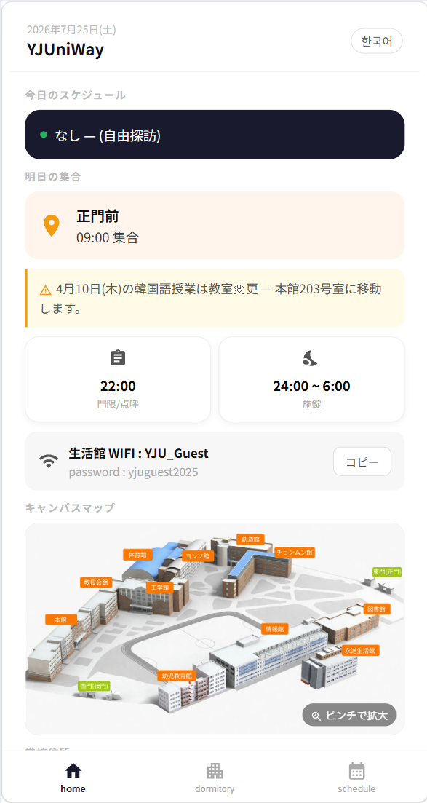
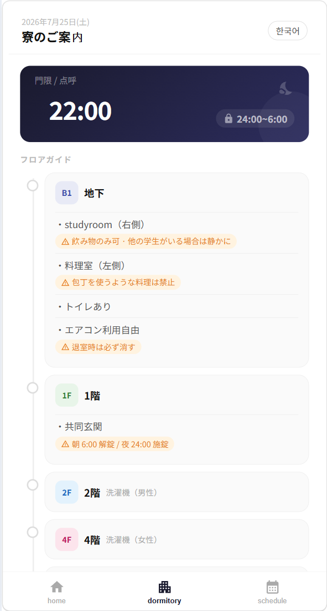
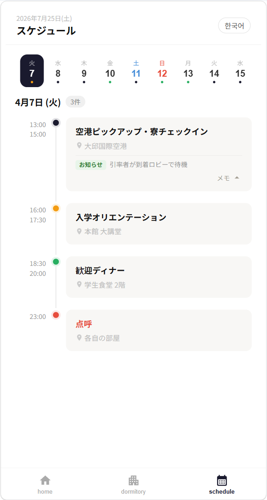
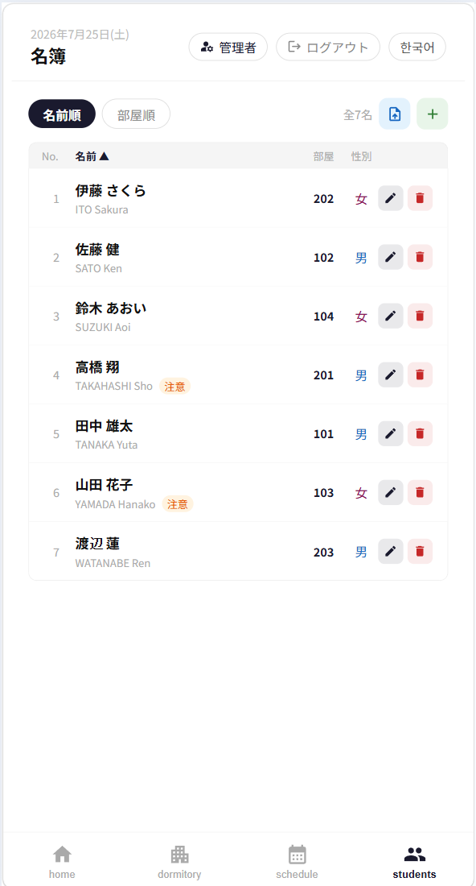
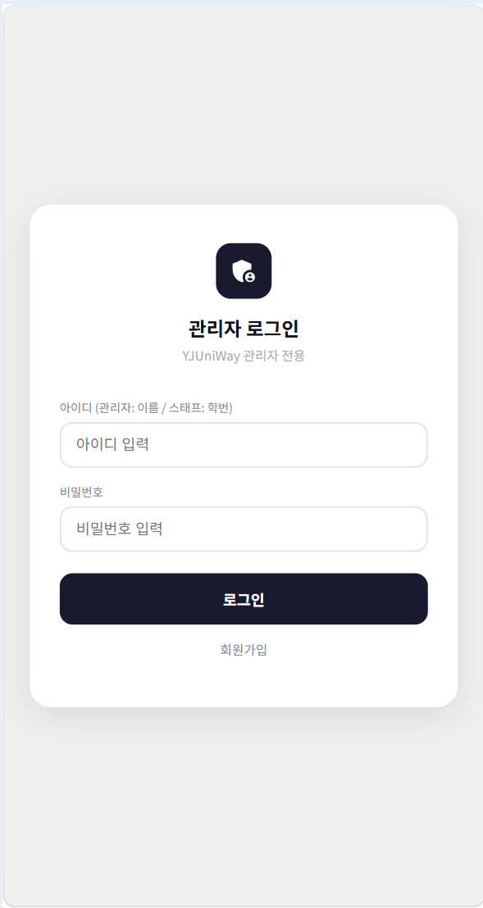
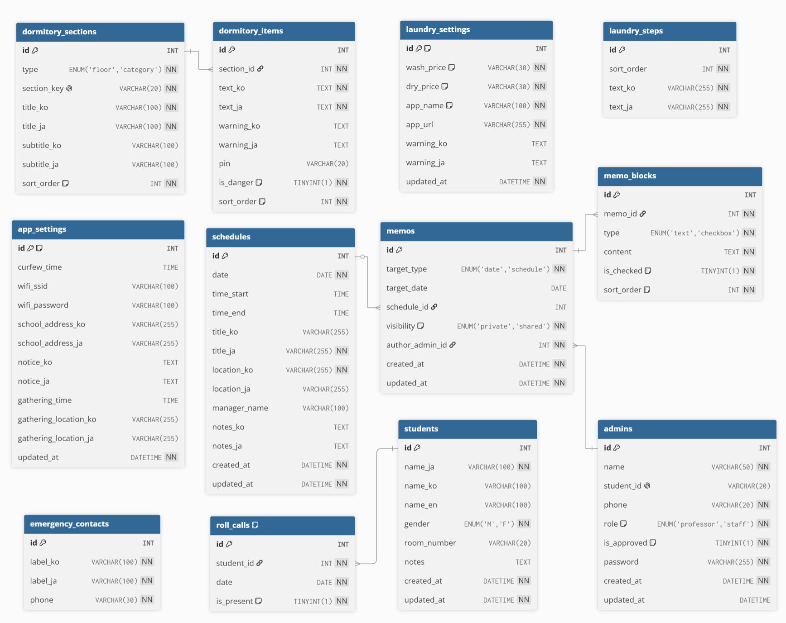

# YJUniWay

영진전문대학교(YJU)로 단기 유학을 오는 일본 대학생을 위한 관리 웹 애플리케이션.
일정, 기숙사 안내, 학생 명단, 관리자별 메모 등을 관리하며 한국어/일본어 두 언어를 지원한다.
모바일 퍼스트(주 사용 환경이 스마트폰)로 설계됨.

---

## 기술 스택

| 영역 | 기술 |
|---|---|
| Frontend | React 19, Redux Toolkit, React Router v7, TypeScript, Vite, MUI |
| Backend | NestJS 11, TypeORM, TypeScript |
| Database | MySQL 8 |
| 인증 | JWT (Passport), sha256 비밀번호 해싱 |
| AI | Anthropic Claude API (문서 파싱, 필드별 한→일 자동 번역) |
| 다국어 | i18next (실제 문구는 컴포넌트별 `isKo` 삼항 분기 방식) |
| API 문서 | Swagger (`/api/docs`) |
| 인프라 | Docker / docker-compose (개발용 · AWS 배포용 프로덕션 구성 별도) |

---

## 프로젝트 구조

```
YJUniWay/
├── frontend/
│   └── src/
│       ├── pages/
│       │   ├── Main/           # 메인 (오늘/내일 일정, 통금, WiFi, 공지, 연락처)
│       │   ├── Dormitory/      # 기숙사 안내 + Laundry 서브페이지
│       │   ├── Schedule/       # 전체 일정 + AI 파싱/일괄등록 + 관리자 메모
│       │   ├── StudentList/    # 명단 (관리자 전용 CRUD + AI 문서 파싱)
│       │   └── Admin/          # 로그인 / 회원가입 / 관리자 목록
│       ├── components/
│       │   ├── PageLayout.tsx  # 공통 레이아웃 (헤더 + BottomTab)
│       │   └── BottomTab.tsx   # 하단 탭 네비게이션
│       ├── store/
│       │   ├── index.ts
│       │   └── slices/         # authSlice, memoSlice 등 (Redux Toolkit)
│       ├── hooks/               # useAppDispatch / useAppSelector
│       ├── api/                 # 백엔드 API 클라이언트 (axios)
│       ├── types/index.ts       # 공통 TypeScript 타입 정의
│       └── i18n/index.ts
│
├── backend/
│   └── src/
│       ├── utils/translate.util.ts   # 한→일 번역 공용 함수 (schedule/dormitory/laundry 공유)
│       └── modules/
│           ├── admin/       # 로그인(JWT), 관리자 CRUD, 역할 전환
│           ├── auth/        # AuthModule + JwtStrategy + Roles/JwtAuthGuard
│           ├── student/     # 학생 CRUD + AI 문서 파싱 + 점호(백엔드만)
│           ├── schedule/    # 일정 CRUD + AI 파싱/일괄등록 + 번역
│           ├── memo/        # 스케줄/날짜별 관리자 메모 (개인/공유)
│           ├── dormitory/   # 기숙사 섹션/항목 CRUD + 번역
│           ├── laundry/     # 세탁기 설정/사용순서 CRUD + 번역
│           └── settings/    # AppSettings(통금/WiFi/공지/집합안내), EmergencyContact
│
├── database/
│   ├── 01_schema.sql        # 스키마
│   ├── 02_mock_data.sql     # 로컬 개발용 목데이터
│   └── prod-seed/           # AWS 배포용 프로덕션 초기 시드 데이터
│
├── docker-compose.yml       # 로컬 개발용
├── docker-compose.prod.yml  # AWS 배포용 프로덕션 구성
├── .env.example
└── package.json              # 루트 (npm workspaces)
```

> `frontend/src/mock/` 폴더는 완전히 삭제됨(2026-07-24) — 더 이상 존재하지 않음

---

## 사용자 권한

| 유형 | 접근 방식 | 비고 |
|---|---|---|
| 학생 | 로그인 없음, URL 비공개 방식 | 명단 페이지 접근 불가 |
| 관리자 (`role: professor`) | `studentId` 없으면 이름, 있으면 학번으로 로그인 | 관리자 목록 접근 가능. DB enum·컬럼명은 `professor`이지만 화면 표기는 "관리자"로 통일 |
| 스태프 (`role: staff`) | 학번으로 로그인 | 관리자 승인 후 활성화. 승인된 스태프는 관리자가 "권한" 버튼으로 관리자 전환 가능 |

- 프론트 인증 상태: Redux `authSlice` + `localStorage`
- 백엔드 인가: `JwtAuthGuard` + `RolesGuard`/`@Roles()` — 관리자 목록 조회/수정/삭제는 `AdminRole.PROFESSOR` 전용
- 마지막 남은 관리자는 스태프로 강등 불가, 자기 자신의 권한은 스스로 변경 불가 등 안전장치가 백엔드에 구현되어 있음

---

## 주요 기능

- **다국어 콘텐츠**: `_ko`/`_ja` 컬럼 분리 저장. 관리자가 필드별 "번역" 버튼으로 명시적으로 트리거하면 해당 필드만 AI 번역
- **일정 AI 문서 파싱 + 일괄 등록**: PDF/이미지 업로드 → AI가 날짜별 일정 추출 → 미리보기(선택/수정) → 일괄 등록(트랜잭션, 전체 성공/전체 롤백)
- **학생 명단 AI 문서 파싱**: 명단 PDF/이미지 업로드 → AI 파싱 → 관리자 확인/수정 → 확정
- **스케줄 관리자별 메모**: 날짜 단위 또는 특정 일정 단위로 메모 작성, 개인용/전체공유 구분
- **모바일 퍼스트**: 주 사용 환경이 모바일이므로 모바일 UI/UX 기준으로 설계
- **관리자/스태프 권한 분리 + 역할 전환**: 승인 워크플로우 + 관리자에 의한 스태프 ↔ 관리자 전환

---

## 시작하기

### 로컬 직접 실행

```bash
# 환경변수 설정
cp .env.example backend/.env
# backend/.env 에서 DB 접속 정보, JWT_SECRET, ANTHROPIC_API_KEY 등 수정

# 의존성 설치
npm install

# 백엔드 (http://localhost:3000)
npm run dev:backend

# 프론트엔드 — 별도 터미널 (http://localhost:5173)
npm run dev:frontend

# 빌드
npm run build:backend
npm run build:frontend
```

Swagger API 문서: `http://localhost:3000/api/docs`

### Docker 실행 (개발용)

```bash
cp .env.example .env   # 값 채워넣기
docker-compose up --build       # 또는 -d 로 백그라운드
docker-compose down
```

| 서비스 | 로컬 직접 실행 | Docker(개발용) |
|---|---|---|
| Frontend | `http://localhost:5173` | `http://localhost:5173` |
| Backend | `http://localhost:3000` | `http://localhost:3007` (컨테이너 내부는 3000) |
| MySQL | `localhost:3306` | `localhost:3306` |
| Swagger | `http://localhost:3000/api/docs` | `http://localhost:3007/api/docs` |

### Docker 실행 (프로덕션 / AWS 배포용)

```bash
docker-compose -f docker-compose.prod.yml up --build -d
```

- `database/01_schema.sql` + `database/prod-seed/02_seed_data.sql`로 초기화됨(개발용 목데이터는 사용하지 않음)
- 프론트는 `frontend/Dockerfile.prod`로 정적 빌드 후 80번 포트로 서빙, 백엔드는 `backend/Dockerfile.prod`로 프로덕션 모드 실행

---

## 환경변수 (`.env` / `backend/.env`)

| 변수 | 설명 | 예시 |
|---|---|---|
| `NODE_ENV` | 실행 환경 | `development` / `production` |
| `PORT` | 백엔드 포트 (컨테이너 내부) | `3000` |
| `FRONTEND_URL` | CORS 허용 URL | `http://localhost:5173` |
| `DB_HOST` | DB 호스트 | `localhost` (Docker에서는 `mysql`) |
| `DB_PORT` | DB 포트 | `3306` |
| `DB_USERNAME` | DB 유저명 | `root` |
| `DB_PASSWORD` | DB 비밀번호 | - |
| `DB_NAME` | DB 이름 | `yjuniway` |
| `JWT_SECRET` | JWT 서명 키 | - |
| `JWT_EXPIRES_IN` | JWT 만료 기간 | `7d` |
| `ANTHROPIC_API_KEY` | Claude API 키 (명단/일정 파싱, 번역에 사용) | - |
| `VITE_API_URL` | 프론트에서 사용할 API URL | 로컬 `http://localhost:3000/api` / Docker `http://localhost:3007/api` |

> 실제 `.env` 파일은 절대 커밋하지 않는다.

---

## API 엔드포인트

> 🔒 표시된 엔드포인트는 JWT Bearer 토큰 필요. `professor` 표시는 관리자(`AdminRole.PROFESSOR`) 전용.
> Swagger 문서: `/api/docs`

### 관리자 `/api/admin`

| 메서드 | 경로 | 설명 |
|---|---|---|
| POST | `/api/admin/login` | 로그인 (학번 우선 조회 → 없으면 이름, 스태프는 승인 필요) |
| GET | `/api/admin` | 🔒 professor 관리자 목록 조회 |
| POST | `/api/admin` | 회원가입 신청 (스태프로 대기 상태 생성) |
| PUT | `/api/admin/:id` | 🔒 professor 수정 (승인 토글, 역할 전환 등) |
| DELETE | `/api/admin/:id` | 🔒 professor 삭제 |

### 일정 `/api/schedule`

| 메서드 | 경로 | 설명 |
|---|---|---|
| GET | `/api/schedule` | 전체 일정 조회 (`?date=YYYY-MM-DD` 필터) |
| POST | `/api/schedule` | 🔒 일정 단건 등록 |
| PUT | `/api/schedule/:id` | 🔒 일정 수정 |
| DELETE | `/api/schedule` | 🔒 전체 삭제 |
| DELETE | `/api/schedule/:id` | 🔒 일정 삭제 |
| POST | `/api/schedule/bulk` | 🔒 AI 파싱 결과 일괄 등록 (트랜잭션) |
| POST | `/api/schedule/translate` | 🔒 필드 번역 |
| POST | `/api/schedule/parse-document` | 🔒 PDF/이미지 AI 파싱 (추출+번역 2단계) |

### 학생 명단 `/api/student` (🔒 전체 인증 필요)

| 메서드 | 경로 | 설명 |
|---|---|---|
| GET | `/api/student` | 학생 명단 조회 |
| POST | `/api/student` | 학생 등록 |
| PUT | `/api/student/:id` | 학생 수정 |
| DELETE | `/api/student/:id` | 학생 삭제 |
| POST | `/api/student/parse-document` | 명단 PDF/이미지 AI 파싱 |
| GET | `/api/student/roll-call` | 점호 조회 (`?date=YYYY-MM-DD`) — 프론트 미연결 |
| PUT | `/api/student/roll-call/:id` | 점호 체크 업데이트 — 프론트 미연결 |

### 기숙사 `/api/dormitory`

| 메서드 | 경로 | 설명 |
|---|---|---|
| GET | `/api/dormitory/floor` | 층별 섹션 조회 |
| GET | `/api/dormitory/category` | 카테고리 섹션 조회 |
| POST | `/api/dormitory/section` | 🔒 섹션 등록 |
| PUT | `/api/dormitory/section/:id` | 🔒 섹션 수정 |
| DELETE | `/api/dormitory/section/:id` | 🔒 섹션 삭제 (항목 포함) |
| POST | `/api/dormitory/item` | 🔒 항목 등록 |
| PUT | `/api/dormitory/item/:id` | 🔒 항목 수정 |
| DELETE | `/api/dormitory/item/:id` | 🔒 항목 삭제 |
| POST | `/api/dormitory/translate` | 🔒 필드 번역 |

> 프론트 UI에는 섹션 추가/삭제 없음(항목 CRUD만) — 층/카테고리 구조가 고정 배지·아이콘 매핑에 묶여 있어 의도적으로 제외됨

### 세탁기 `/api/laundry`

| 메서드 | 경로 | 설명 |
|---|---|---|
| GET | `/api/laundry/settings` | 요금/앱정보/주의사항 조회 |
| PUT | `/api/laundry/settings` | 🔒 설정 수정 |
| GET | `/api/laundry/steps` | 사용순서 조회 |
| POST | `/api/laundry/step` | 🔒 사용순서 등록 |
| PUT | `/api/laundry/step/:id` | 🔒 사용순서 수정 (재배치 포함) |
| DELETE | `/api/laundry/step/:id` | 🔒 사용순서 삭제 |
| POST | `/api/laundry/translate` | 🔒 필드 번역 |

> 영상/이미지는 정적 파일(`frontend/src/assets`) 방식 유지 — DB 컬럼 없음

### 설정 `/api/settings`

| 메서드 | 경로 | 설명 |
|---|---|---|
| GET | `/api/settings` | 통금/WiFi/학교주소/공지/내일 집합 안내 조회 |
| PUT | `/api/settings` | 🔒 설정 수정 |
| GET | `/api/settings/contacts` | 긴급 연락처 목록 조회 |
| POST | `/api/settings/contacts` | 🔒 연락처 등록 |
| PUT | `/api/settings/contacts/:id` | 🔒 연락처 수정 |
| DELETE | `/api/settings/contacts/:id` | 🔒 연락처 삭제 |

### 메모 `/api/memo` (🔒 전체 인증 필요)

| 메서드 | 경로 | 설명 |
|---|---|---|
| GET | `/api/memo` | 대상(`?targetType=date\|schedule`)의 공유 메모 + 본인 개인 메모 조회 |
| POST | `/api/memo/blocks` | 메모 줄 추가 (대상 문서 없으면 자동 생성) |
| PATCH | `/api/memo/blocks/:id` | 메모 줄 내용 수정 (비우면 자동 삭제) |
| PATCH | `/api/memo/blocks/:id/toggle` | 체크박스 줄 체크 토글 |
| DELETE | `/api/memo/:id` | 메모 문서 전체 삭제 (작성자 본인 또는 관리자) |

---

## 페이지 구성 (프론트)

| 경로 | 접근 | 주요 기능 |
|---|---|---|
| `/` | 전체 (링크) | 오늘/내일 일정, 통금, WiFi, 긴급 연락처, 공지, 내일 집합 안내 |
| `/dormitory`, `/dormitory/laundry` | 전체 (링크) | 시설 안내, 규칙, 세탁기 사용법/요금 |
| `/schedule` | 전체 (링크) | 전체 일정, 관리자 메모, AI 일괄등록(관리자) |
| `/students` | 관리자/스태프 | 학생 정보 CRUD, AI 문서 파싱 |
| `/admin`, `/admin/signup`, `/admin/admins` | 전체 / 관리자 | 로그인, 회원가입 신청, 관리자 목록·역할 전환(관리자 전용) |

> 학생 페이지는 로그인 없이 링크를 아는 사람만 접근. 관리자/스태프 페이지는 로그인 필요.

### 화면

> 스크린샷 미준비 상태 — 아래 경로에 파일 추가 시 자동으로 표시됨(모바일 뷰 기준 캡처 권장).

| 메인 | 기숙사 | 일정 |
|---|---|---|
|  |  |  |

| 명단 (관리자) | 관리자 로그인 |
|---|---|
|  |  |

---

## ERD



<!--
아래는 위 image.png를 dbdiagram.io(https://dbdiagram.io)에서 재생성하기 위한 DBML 원본.
`database/01_schema.sql` 기준(2026-07-25 기준 최신, memos/memo_blocks/laundry_settings/laundry_steps 포함).
스키마가 바뀌면 이 DBML을 고치고 dbdiagram.io에 붙여넣어 PNG로 export → image.png 교체.

```dbml
Table admins {
  id INT [pk, increment]
  name VARCHAR(50) [not null]
  student_id VARCHAR(20) [unique]
  phone VARCHAR(20) [not null]
  role "ENUM('professor','staff')" [not null, default: `staff`]
  is_approved TINYINT(1) [not null, default: 0]
  password VARCHAR(255) [not null]
  created_at DATETIME [not null]
  updated_at DATETIME
}

Table students {
  id INT [pk, increment]
  name_ja VARCHAR(100) [not null]
  name_ko VARCHAR(100)
  name_en VARCHAR(100)
  gender "ENUM('M','F')" [not null]
  room_number VARCHAR(20)
  notes TEXT
  created_at DATETIME [not null]
  updated_at DATETIME [not null]
}

Table schedules {
  id INT [pk, increment]
  date DATE [not null]
  time_start TIME
  time_end TIME
  title_ko VARCHAR(255)
  title_ja VARCHAR(255) [not null]
  location_ko VARCHAR(255) [not null]
  location_ja VARCHAR(255)
  manager_name VARCHAR(100)
  notes_ko TEXT
  notes_ja TEXT
  created_at DATETIME [not null]
  updated_at DATETIME [not null]
}

Table memos {
  id INT [pk, increment]
  target_type "ENUM('date','schedule')" [not null]
  target_date DATE
  schedule_id INT [ref: > schedules.id]
  visibility "ENUM('private','shared')" [not null, default: `shared`]
  author_admin_id INT [not null, ref: > admins.id]
  created_at DATETIME [not null]
  updated_at DATETIME [not null]
}

Table memo_blocks {
  id INT [pk, increment]
  memo_id INT [not null, ref: > memos.id]
  type "ENUM('text','checkbox')" [not null]
  content TEXT [not null]
  is_checked TINYINT(1) [not null, default: 0]
  sort_order INT [not null, default: 0]
}

Table dormitory_sections {
  id INT [pk, increment]
  type "ENUM('floor','category')" [not null]
  section_key VARCHAR(20) [not null, unique]
  title_ko VARCHAR(100) [not null]
  title_ja VARCHAR(100) [not null]
  subtitle_ko VARCHAR(100)
  subtitle_ja VARCHAR(100)
  sort_order INT [not null, default: 0]
}

Table dormitory_items {
  id INT [pk, increment]
  section_id INT [not null, ref: > dormitory_sections.id]
  text_ko TEXT [not null]
  text_ja TEXT [not null]
  warning_ko TEXT
  warning_ja TEXT
  pin VARCHAR(20)
  is_danger TINYINT(1) [not null, default: 0]
  sort_order INT [not null, default: 0]
}

Table app_settings {
  id INT [pk, default: 1]
  curfew_time TIME
  wifi_ssid VARCHAR(100)
  wifi_password VARCHAR(100)
  school_address_ko VARCHAR(255)
  school_address_ja VARCHAR(255)
  notice_ko TEXT
  notice_ja TEXT
  gathering_time TIME
  gathering_location_ko VARCHAR(255)
  gathering_location_ja VARCHAR(255)
  updated_at DATETIME [not null]
}

Table emergency_contacts {
  id INT [pk, increment]
  label_ko VARCHAR(100) [not null]
  label_ja VARCHAR(100) [not null]
  phone VARCHAR(30) [not null]
}

Table laundry_settings {
  id INT [pk, default: 1]
  wash_price VARCHAR(30) [not null, default: `700원`]
  dry_price VARCHAR(30) [not null, default: `700원~`]
  app_name VARCHAR(100) [not null, default: `메타클럽`]
  app_url VARCHAR(255) [not null]
  warning_ko TEXT
  warning_ja TEXT
  updated_at DATETIME [not null]
}

Table laundry_steps {
  id INT [pk, increment]
  sort_order INT [not null]
  text_ko VARCHAR(255) [not null]
  text_ja VARCHAR(255) [not null]
}

Table roll_calls {
  id INT [pk, increment]
  student_id INT [not null, ref: > students.id]
  date DATE [not null]
  is_present TINYINT(1) [not null, default: 0]

  indexes {
    (student_id, date) [unique]
  }
}
```
-->
